# Laboratório 02 — Estratégias e Níveis de Teste na Prática
**Domínio:** Plataforma de E-commerce (Shop 20) - Função "Adicionar ao Carrinho"

---

## 1. Teste de Unidade (Unit Testing)

### 1.1 — Verificação de lógica atômica em componente/classe isolada

#### 1. Diagrama de Classes UML
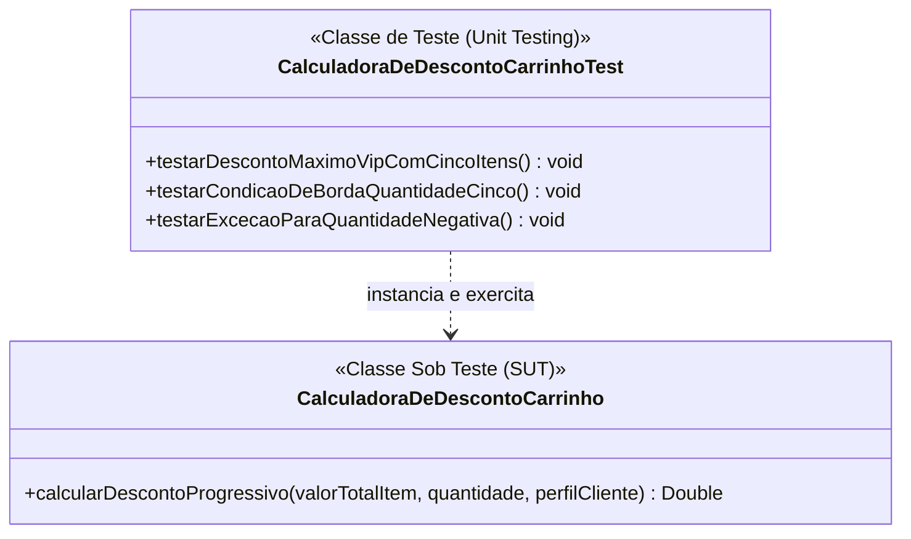

#### 2. Explicação Textual do Cenário
**Contexto:** No Shop20, usamos o Teste de Unidade para testar a classe CalculadoraCarrinho totalmente sozinha, sem conectar com o banco de dados. A classe de teste envia as informações (valor, quantidade, perfil VIP) direto para a calculadora e confere se o resultado final bate com o esperado. Isso serve para achar erros nas contas matemáticas ou bloquear dados errados (como uma quantidade negativa) logo no começo da programação, antes de juntar com o resto do sistema.

**Como a abordagem é aplicada:** o método `testarDescontoMaximoVipComCincoItens()` confirma que um cliente VIP com 5 itens recebe o percentual máximo de desconto; `testarCondicaoDeBordaQuantidadeCinco()` verifica o comportamento exatamente no limiar que muda a faixa de desconto; e `testarExcecaoParaQuantidadeNegativa()` garante que `calcularDescontoProgressivo()` rejeita uma quantidade inválida em vez de retornar um valor incorreto silenciosamente.

**Objetivo e Defeitos Revelados:** Garantir a corretude da lógica matemática. Revela cálculos incorretos e validar perfil do cliente antes de juntar com o resto do sistema.

---

## 2. Teste de Integração (Integration Testing)

### 2.1 — Integração Não Incremental (Big Bang)

#### 1. Diagrama de Sequência UML
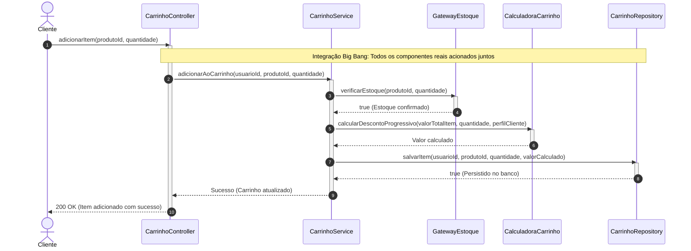

#### 2. Explicação Textual do Cenário
**Contexto:** Abordagem que junta todos os módulos desenvolvidos de uma só vez para verificar se funcionam em conjunto.

**Como a abordagem é aplicada:** O teste aciona o Controller passando o ID do produto e a quantidade. O fluxo percorre os 5 módulos reais (`CarrinhoController`, `CarrinhoService`, `GatewayEstoque`, `CalculadoraCarrinho`, `CarrinhoRepository`) em sequência, até chegar ao banco de dados. Se o item aparecer salvo corretamente no final, o teste passa.
**Objetivo e Defeitos Revelados:** Validar se os módulos conversam entre si. Revela falhas de injeção de dependência e erros de comunicação de rede.

---

### 2.2 — Integração Incremental Top-Down (Descendente) com uso de Stubs

#### 1. Diagrama de Classes UML
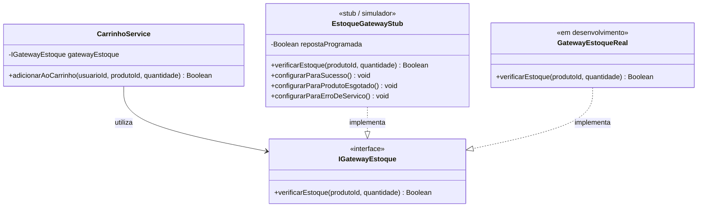

#### 2. Explicação Textual do Cenário
**Contexto:** A classe superior precisa consultar o estoque, mas a API real está indisponível.

**Como a abordagem é aplicada:** O `CarrinhoService` (topo) é testado utilizando um `EstoqueGatewayStub` (simulador) que substitui a camada inferior. O Stub é programado com três respostas fixas distintas: `configurarParaSucesso()`, para simular item disponível; `configurarParaProdutoEsgotado()`, para simular ausência de estoque; e `configurarParaErroDeServico()`, para simular uma falha de infraestrutura no gateway real (ex.: timeout), diferente de um simples "sem estoque".

**Objetivo e Defeitos Revelados:** Revela falhas na lógica condicional de alto nível ao tratar as diferentes respostas que a camada inferior poderia enviar — incluindo se `CarrinhoService` trata um erro de serviço da mesma forma (incorreta) que trataria um produto esgotado.

---

### 2.3 — Integração Incremental Bottom-Up (Ascendente) com uso de Drivers

#### 1. Diagrama de Sequência UML
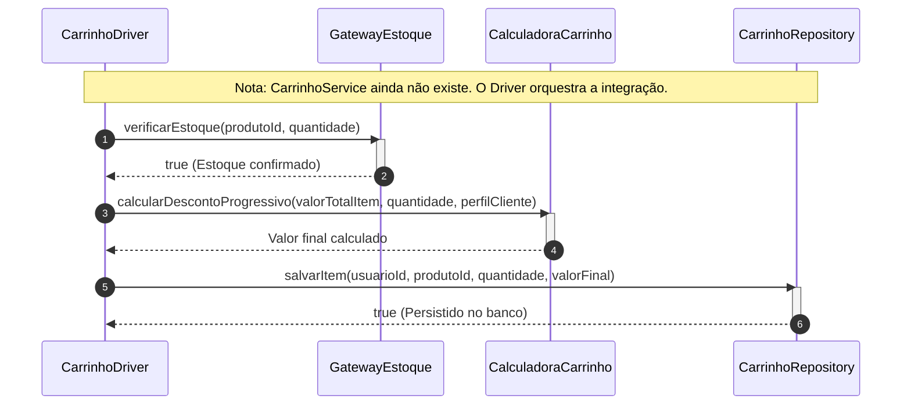

#### 2. Explicação Textual do Cenário
**Contexto:** Neste cenário, a base do sistema (`GatewayEstoque`, `CalculadoraCarrinho` e `CarrinhoRepository`) já está pronta, mas o serviço principal que orquestra tudo (`CarrinhoService`) ainda não foi programado.

**Como a abordagem é aplicada:** Para testar se esses componentes da base conseguem trabalhar em conjunto, criamos um simulador temporário (o `CarrinhoDriver`). Esse Driver instancia os 3 módulos reais e faz as chamadas em sequência: primeiro ele verifica o estoque, depois calcula o preço e, por fim, salva o item no banco de dados.

**Objetivo e Defeitos Revelados:** Validar que os módulos de base funcionam corretamente em conjunto antes de existir um controlador que os una. Revela erros de interface entre `GatewayEstoque`, `CalculadoraCarrinho` e `CarrinhoRepository` — por exemplo, o formato do valor retornado por `calcularDescontoProgressivo()` não sendo o que `salvarItem()` espera receber.

---

### 2.4 — Teste de Fumaça (Smoke Testing)

#### 1. Diagrama de Sequência UML
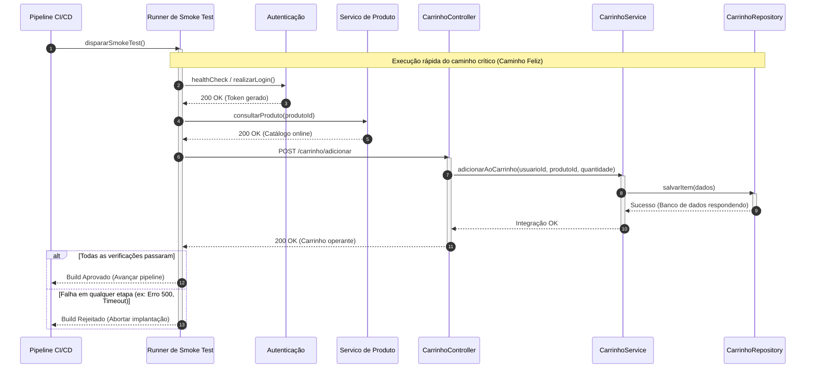

#### 2. Explicação Textual do Cenário
**Contexto:** O teste de fumaça serve para responder a uma pergunta fundamental: "O sistema básico está respirando?". Se o usuário consegue fazer o mínimo esperado, como adicionar um item ao carrinho, as integrações principais estão saudáveis e a versão é considerada "estável".

**Como a abordagem é aplicada:** Um script automatizado (Runner) dispara requisições superficiais e rápidas no caminho principal (login, consulta e adição ao carrinho) e valida conexões com as APIs e o banco, sem focar em cálculos ou cenários de erro.
**Objetivo e Defeitos Revelados:** Detecta defeitos bloqueantes instantâneos, como portas de firewall fechadas ou senhas de banco incorretas.

---

### 2.5 — Teste de Regressão

#### 1. Diagrama de Sequência UML
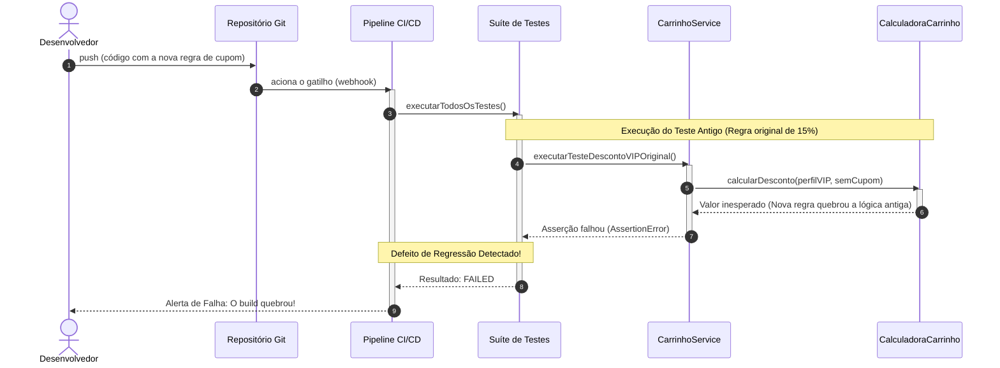

#### 2. Explicação Textual do Cenário
**Contexto:** Um novo recurso (uma regra de cupom de desconto, que passa a ser um parâmetro adicional de `CalculadoraCarrinho`) foi adicionado ao projeto e pode ter quebrado o que já funcionava no cálculo do carrinho.

**Como a abordagem é aplicada:** Um servidor de integração contínua (CI/CD) agrupa todos os testes criados anteriormente em uma Suíte de Testes e os reexecuta automaticamente ao menor sinal de alteração no código-fonte, inclusive `executarTesteDescontoVIPOriginal()`, que chama `calcularDescontoProgressivo()` exatamente como nas seções anteriores, sem informar cupom, para confirmar que o comportamento antigo continua igual.

**Objetivo e Defeitos Revelados:** Revela efeitos colaterais indesejados onde código novo corrompe funcionalidades antigas.

---

## 3. Teste de Validação (Validation Testing)

### 3.1 - Critérios de Aceitação 

#### 1. Diagrama de Sequência UML
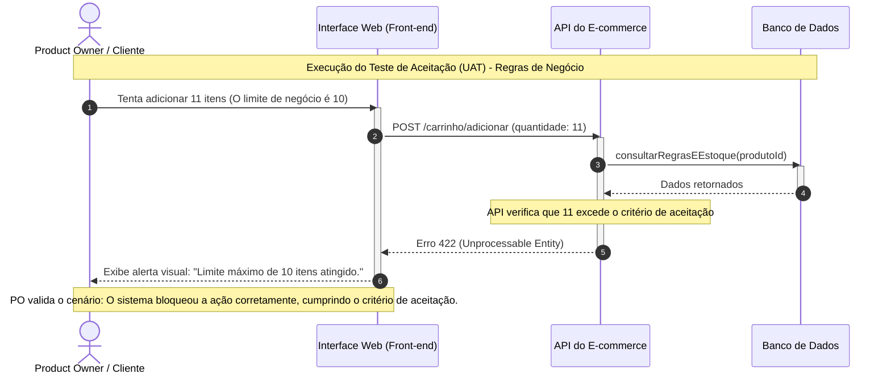
#### 2. Explicação Textual do Cenário
**Contexto:** Nesse teste, busca-se validar se o sistema realmente atende às necessidades e expectativas do usuário e aos requisitos definidos para o sistema. Considerando a quantidade de itens que o usúario deseja adicionar ao carrinho.

**Como a abordagem é aplicada:** Considerando que o usuário esteja logado e tente adicionar 11 itens ao carrinho, o sistema deverá consultar e aplicar a regra de negócio que estabelece o limite máximo de 10 itens, por meio da função `consultarRegrasEEstoque(produtoId)`. Como resultado, a ação deverá ser bloqueada, retornando o status **422 — Unprocessable Entity**, e o sistema deverá exibir uma mensagem de alerta ao usuário informando que o limite máximo de itens do carrinho foi atingido.

**Objetivo e Defeitos Revelados:** Validar que o sistema respeita uma regra de negócio definida pelo cliente, do ponto de vista do usuário final — não da implementação interna. Revela regras de negócio mal implementadas ou ausentes (ex.: o limite de 10 itens não sendo verificado) e mensagens de erro pouco claras para o usuário.

### 3.2 Teste Alfa

#### 1. Diagrama de Sequência UML
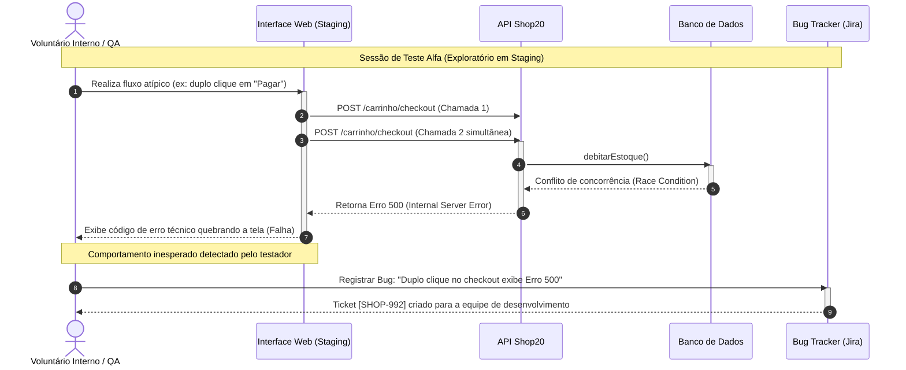
#### 2. Explicação Textual do Cenário
**Contexto:** O Teste Alfa ocorre quando a nova versão do Shop20 está finalizada do ponto de vista do desenvolvimento, mas ainda não é segura o suficiente para ser liberada aos clientes reais. Ele é realizado no ambiente de Staging (Homologação), que atua como uma réplica exata do ambiente de Produção. Para simular a experiência real, o teste é conduzido pela Equipe de QA que orquestra e coleta as métricas em conjunto com funcionários voluntários de outros setores (como RH e Atendimento).

**Como a abordagem é aplicada:** Como o objetivo é simular o uso real do produto, a abordagem é de teste exploratório e livre. Por exemplo, por impaciência ou erro humano, um voluntário pode realizar um duplo clique no botão "Pagar". Esse comportamento imprevisto dispara duas requisições simultâneas de DebitarEstoque. O banco de dados acusa um erro de concorrência, retornando o status 500 (Internal Server Error) e exibindo uma mensagem técnica que quebra a tela do usuário.

**Objetivos e Defeitos revelados** Identificar comportamentos inesperados, problemas de usabilidade e bugs não mapeados (como condições de corrida ou erros não tratados na interface) antes que o sistema seja exposto a clientes externos, atuando como um filtro de qualidade de negócio.

### 3.3 Teste Beta 

#### 1. Diagrama de Sequência UML
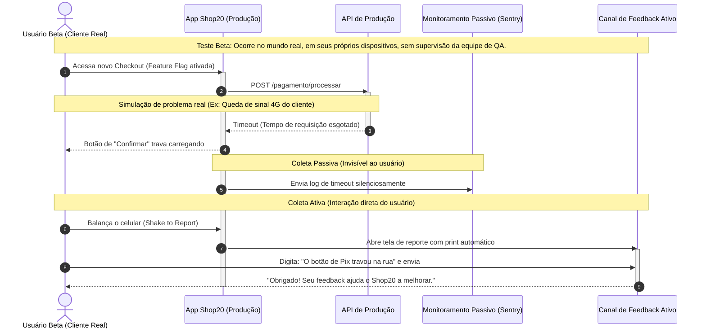
#### 2. Explicação Textual do Cenário
**Contexto:** A nova versão do sistema, como o novo Checkout Unificado do Marketplace, já passou pelo Teste Alfa e foi implantada no ambiente de Produção. No entanto, ela ainda não é disponibilizada para todos os usuários. Para controlar essa liberação, utilizamos a técnica de Feature Flag (chave de ativação). O novo código já está presente no sistema, mas a funcionalidade é ativada inicialmente para uma pequena parcela dos clientes, por exemplo, 5% dos clientes mais ativos ou membros VIP do Shop20. Dessa forma, o teste é realizado por clientes reais, utilizando dispositivos, condições de rede e dados reais, diferentemente do Teste Alfa, que ocorre em um ambiente controlado.

**Como a abordagem é aplicada** O Cliente acessa o novo Checkout pelo App Shop20, que está liberado por uma Feature Flag. Ao realizar o pagamento, o App envia uma requisição para a API de Produção. Durante o processo, ocorre uma queda de conexão, causando um Timeout. O problema é registrado automaticamente pelo Monitoramento Passivo (Sentry). Além disso, o Cliente pode utilizar o Canal de Feedback Ativo para relatar o problema, permitindo que a equipe identifique falhas que acontecem em condições reais de uso. 

**Objetivo e Defeitos Revelados:** Validar o comportamento do software no mundo real. Revela com facilidade defeitos de fragmentação de dispositivos (compatibilidade com celulares antigos), falhas em redes instáveis e comportamentos de uso que a equipe interna jamais conseguiria prever.

## 4. Teste de Sistema

### 4.1 — Teste de Recuperação

#### 1. Diagrama de Sequência UML
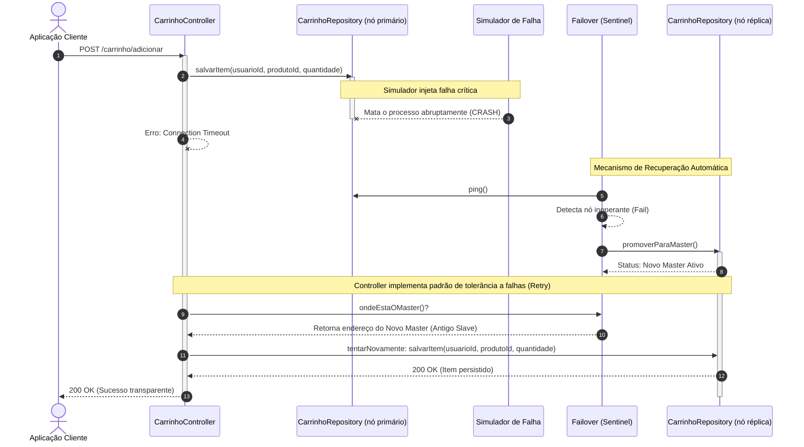

#### 2. Explicação Textual do Cenário
**Contexto:** No Shop20, o `CarrinhoRepository` é implementado sobre um cluster de banco de dados com nó primário e nó réplica, identificados como `CarrinhoRepository (nó primário)` e `CarrinhoRepository (nó réplica)`. Durante um pico de acessos, como a Black Friday, o nó primário pode sofrer uma falha crítica. Para garantir alta disponibilidade, o nó réplica pode assumir seu lugar por meio do `Failover (Sentinel)`. O objetivo do Teste de Recuperação é verificar se o Shop20 consegue continuar funcionando após essa falha sem intervenção humana.

**Como a abordagem é aplicada:** Durante o teste, o Simulador de Falha provoca propositalmente um CRASH no `CarrinhoRepository (nó primário)` enquanto o `CarrinhoController` está chamando `salvarItem()`. O `CarrinhoController` recebe um `Connection Timeout`. Em seguida, o `Failover (Sentinel)` verifica o nó primário, identifica que está inoperante e promove o `CarrinhoRepository (nó réplica)` a novo primário. O `CarrinhoController` consulta o Sentinel para descobrir o novo endereço e refaz a chamada `salvarItem()`, desta vez contra o nó réplica promovido.

**Objetivo e Defeitos Revelados:** Validar se o Shop20 consegue se recuperar automaticamente após a falha do banco principal, mantendo a operação do usuário de adicionar item ao carrinho. Revela problemas como perda de dados no `CarrinhoRepository`, falhas no processo de Failover, indisponibilidade prolongada e erros no mecanismo de Retry.

---

### 4.2 — Teste de Segurança

#### 1. Diagrama de Sequência UML
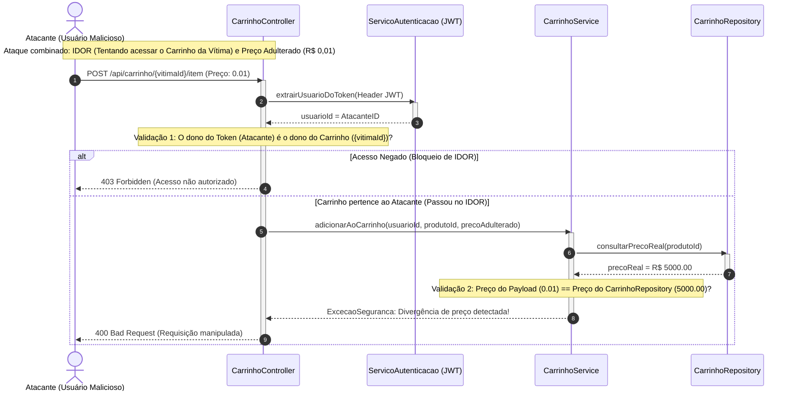

#### 2. Explicação Textual do Cenário
**Contexto:** No Shop20, o Teste de Segurança verifica se o sistema consegue impedir que um usuário mal-intencionado manipule informações do checkout. Nesse cenário, o `Atacante (Usuário Malicioso)` altera a requisição para tentar acessar o carrinho de outra pessoa por meio de um ataque IDOR e também modifica o preço do produto para R$ 0,01, caracterizando Parameter Tampering.

**Como a abordagem é aplicada:** O `Atacante (Usuário Malicioso)` envia uma requisição para o `CarrinhoController` com o `vitimaId` e o preço adulterado. O Controller consulta o `ServicoAutenticacao (JWT)` para identificar o usuário pelo Token. Caso o usuário tente acessar o carrinho de outra pessoa, o sistema bloqueia a requisição com 403 Forbidden. Caso o carrinho pertença ao próprio atacante, a requisição segue para o `CarrinhoService`, que consulta o preço verdadeiro no `CarrinhoRepository` por meio de `consultarPrecoReal(produtoId)`. Ao identificar que o preço enviado é diferente do preço armazenado, o sistema bloqueia a operação e retorna 400 Bad Request.

**Objetivo e Defeitos Revelados:** Validar se o Shop20 protege os dados do usuário e não confia em informações manipuladas pelo cliente. Revela falhas de controle de acesso (IDOR) e problemas de manipulação de parâmetros, como permitir que o preço enviado pelo front-end seja utilizado diretamente no processamento da compra.

---

### 4.3 — Teste de Estresse (Stress Testing)

#### 1. Diagrama de Arquitetura

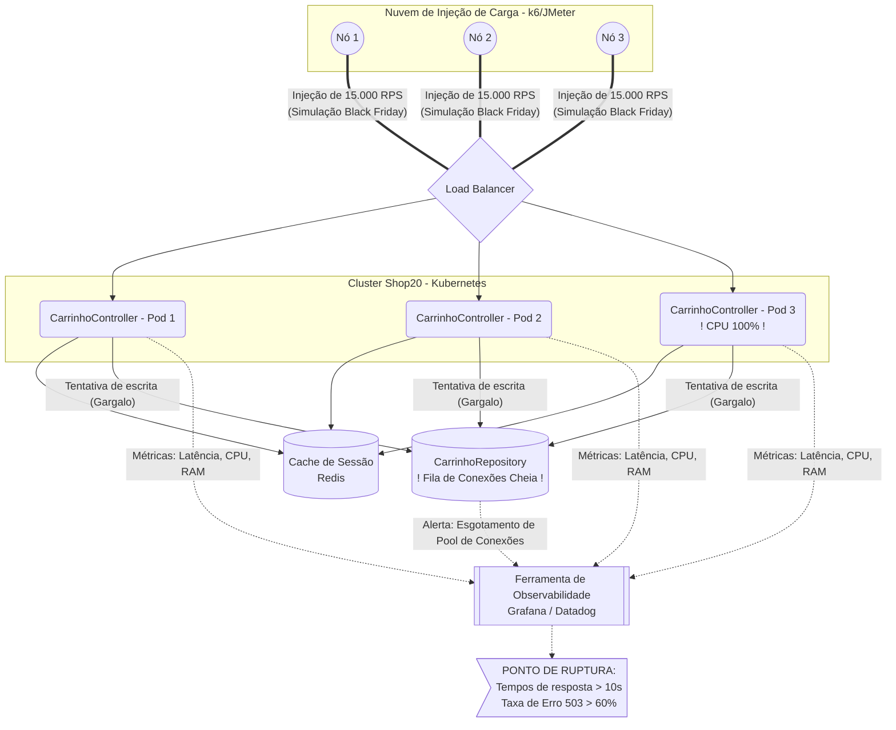

#### 2. Explicação Textual do Cenário
**Contexto:** No Shop20, o Teste de Estresse verifica o comportamento e os limites da arquitetura sob condições extremas de tráfego, simulando um evento de pico como a Black Friday. Nesse cenário, o objetivo não é confirmar se o sistema funciona em condições normais, mas sim submetê-lo a uma carga absurdamente alta (saltando de 500 para 15.000 requisições por segundo) para descobrir qual é o seu exato ponto de ruptura. Cada pod do `Cluster Shop20` roda uma instância do `CarrinhoController`, interagindo com o `CarrinhoRepository` sob extrema pressão de infraestrutura.

**Como a abordagem é aplicada:** Os `Geradores de Carga` em nuvem (utilizando ferramentas como k6 ou JMeter) disparam uma tempestade de acessos simultâneos contra o `Load Balancer`, que distribui o tráfego entre os pods do `CarrinhoController`. Durante o ataque, a `Ferramenta de Observabilidade` (Grafana ou Datadog) monitora métricas vitais como latência, CPU e memória RAM. O teste força a infraestrutura até que um componente crítico ceda — seja a CPU do `CarrinhoController` batendo 100% ou o `CarrinhoRepository` lotando sua fila de conexões —, registrando o momento em que a aplicação colapsa e começa a retornar lentidão severa (tempo de resposta > 10s) ou o erro `503 Service Unavailable`.

**Objetivo e Defeitos Revelados:** Identificar o limite máximo absoluto de capacidade do Shop20 e observar como o sistema reage à própria falha (se morre graciosamente ou corrompe dados). Revela gargalos severos de escalabilidade que não aparecem em testes normais, como esgotamento do pool de conexões do `CarrinhoRepository`, lentidão nos gatilhos de autoscaling dos pods e vazamento de memória sob pressão.

---

### 4.4 — Teste de Desempenho (Performance Testing)

#### 1. Diagrama de Sequência UML

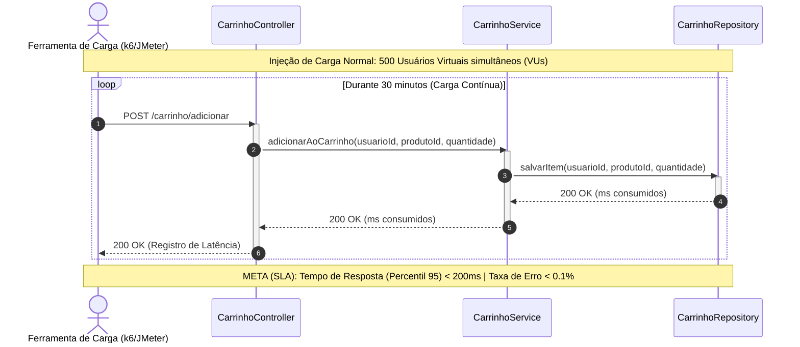

#### 2. Explicação Textual do Cenário
**Contexto:** No Shop20, o Teste de Desempenho avalia se o sistema atende aos Acordos de Nível de Serviço (SLA) estabelecidos para o uso cotidiano. Diferente do Teste de Estresse (que busca quebrar a aplicação), este cenário simula uma carga normal e representativa — por exemplo, 500 usuários simultâneos adicionando produtos ao carrinho de forma constante, fluindo através do `CarrinhoController`, `CarrinhoService` e `CarrinhoRepository`. A meta de qualidade arquitetural é rigorosa: 95% das requisições (p95) devem ser respondidas em menos de 200 milissegundos, com uma taxa de erro máxima aceitável de 0,1%.

**Como a abordagem é aplicada:** A `Ferramenta de Carga` (como k6, Gatling ou JMeter) é estruturada para enviar um fluxo contínuo de requisições em loop durante um período prolongado. A requisição atravessa o `CarrinhoController`, passa pelo `CarrinhoService` e realiza a operação `salvarItem()` no `CarrinhoRepository`. A cada ciclo, a ferramenta de medição não verifica se a resposta está "certa" ou "errada" no sentido de negócio, mas atua como um cronômetro de precisão, agregando as latências e construindo gráficos de percentis em tempo real para avaliar se o sistema sofre degradação ao longo do tempo.

**Objetivo e Defeitos Revelados:** Avaliar a velocidade, a responsividade e a estabilidade do Shop20 nas operações normais. Revela gargalos de desempenho "silenciosos" (problemas que não derrubam o sistema, mas causam lentidão e frustração no usuário), como queries ineficientes no `CarrinhoRepository` por falta de índices, payloads JSON desnecessariamente pesados na rede ou alto tempo de processamento na camada de negócio do `CarrinhoService`.
