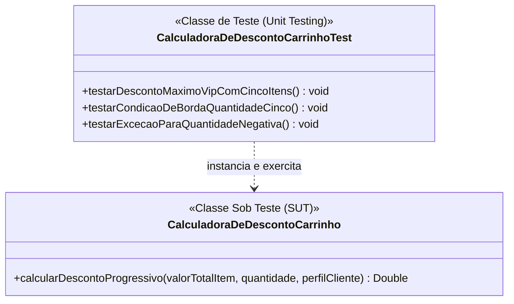
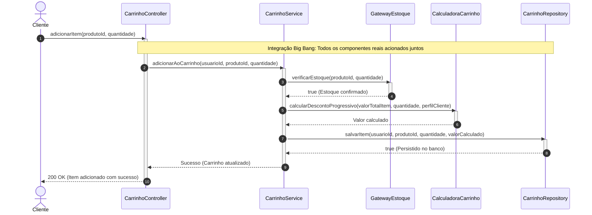
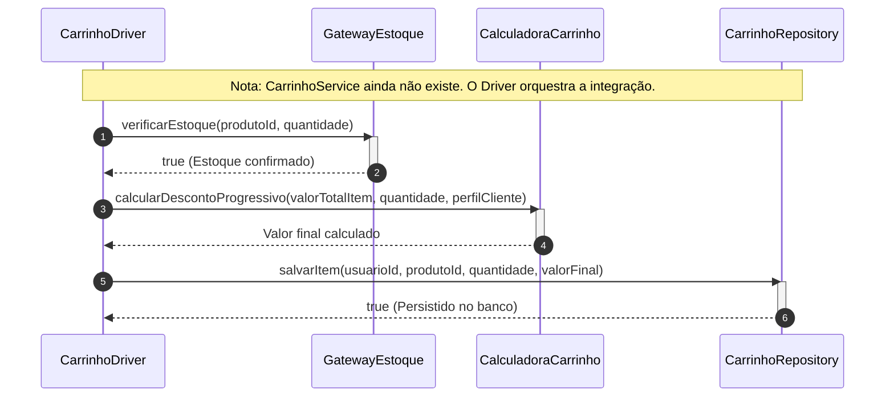
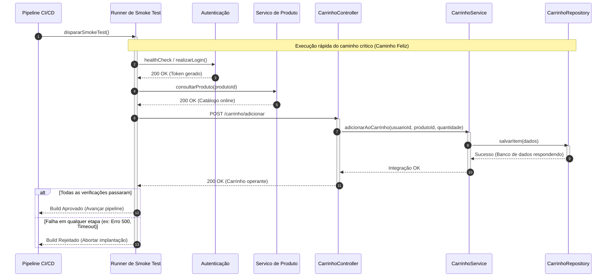
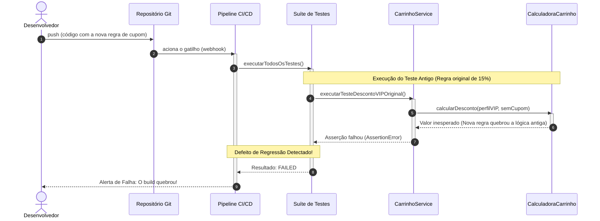
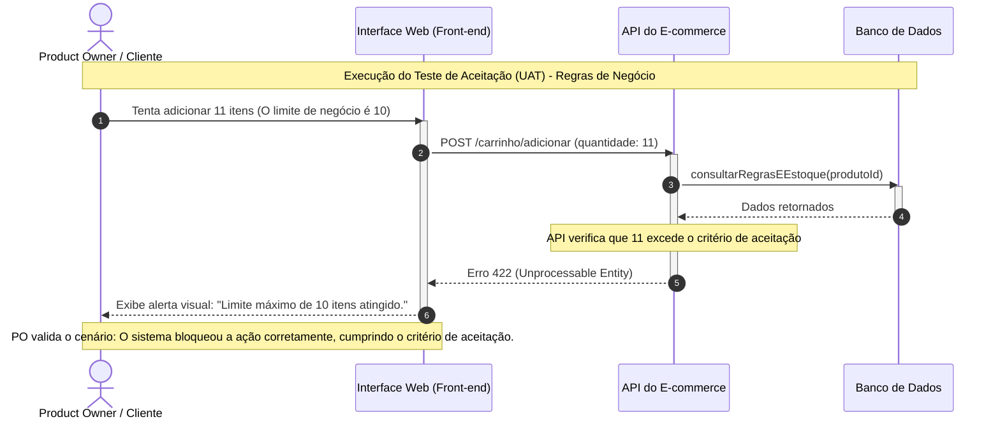

# Laboratório 02 — Estratégias e Níveis de Teste na Prática
**Domínio:** Plataforma de E-commerce (Shop 20) - Função "Adicionar ao Carrinho"

---

## 1. Teste de Unidade (Unit Testing)

### 1.1 — Verificação de lógica atômica em componente/classe isolada

#### 1. Diagrama de Classes UML

#### 2. Explicação Textual do Cenário
**Contexto:** No Shop20, usamos o Teste de Unidade para testar a classe CalculadoraDeDescontoCarrinho totalmente sozinha, sem conectar com o banco de dados. A classe de teste envia as informações (valor, quantidade, perfil VIP) direto para a calculadora e confere se o resultado final bate com o esperado. Isso serve para achar erros nas contas matemáticas ou bloquear dados errados (como uma quantidade negativa) logo no começo da programação, antes de juntar com o resto do sistema.

**Como a abordagem é aplicada:** o método `testarDescontoMaximoVipComCincoItens()` confirma que um cliente VIP com 5 itens recebe o percentual máximo de desconto; `testarCondicaoDeBordaQuantidadeCinco()` verifica o comportamento exatamente no limiar que muda a faixa de desconto; e `testarExcecaoParaQuantidadeNegativa()` garante que `calcularDescontoProgressivo()` rejeita uma quantidade inválida em vez de retornar um valor incorreto silenciosamente.

**Objetivo e Defeitos Revelados:** Garantir a corretude da lógica matemática. Revela cálculos incorretos e validar perfil do cliente antes de juntar com o resto do sistema.

---

## 2. Teste de Integração (Integration Testing)

### 2.1 — Integração Não Incremental (Big Bang)

#### 1. Diagrama de Sequência UML

#### 2. Explicação Textual do Cenário
**Contexto:** Abordagem que junta todos os módulos desenvolvidos de uma só vez para verificar se funcionam em conjunto.

**Como a abordagem é aplicada:** O teste aciona o Controller passando o ID do produto e a quantidade. O fluxo percorre os 5 módulos reais (`CarrinhoController`, `CarrinhoService`, `GatewayEstoque`, `CalculadoraCarrinho`, `CarrinhoRepository`) em sequência, até chegar ao banco de dados. Se o item aparecer salvo corretamente no final, o teste passa.
**Objetivo e Defeitos Revelados:** Validar se os módulos conversam entre si. Revela falhas de injeção de dependência e erros de comunicação de rede.

---

### 2.2 — Integração Incremental Top-Down (Descendente) com uso de Stubs

#### 1. Diagrama de Classes UML

#### 2. Explicação Textual do Cenário
**Contexto:** A classe superior precisa consultar o estoque, mas a API real está indisponível.

**Como a abordagem é aplicada:** O `CarrinhoService` (topo) é testado utilizando um `EstoqueGatewayStub` (simulador) que substitui a camada inferior. O Stub é programado com três respostas fixas distintas: `configurarParaSucesso()`, para simular item disponível; `configurarParaProdutoEsgotado()`, para simular ausência de estoque; e `configurarParaErroDeServico()`, para simular uma falha de infraestrutura no gateway real (ex.: timeout), diferente de um simples "sem estoque".

**Objetivo e Defeitos Revelados:** Revela falhas na lógica condicional de alto nível ao tratar as diferentes respostas que a camada inferior poderia enviar — incluindo se `CarrinhoService` trata um erro de serviço da mesma forma (incorreta) que trataria um produto esgotado.

---

### 2.3 — Integração Incremental Bottom-Up (Ascendente) com uso de Drivers

#### 1. Diagrama de Sequência UML

#### 2. Explicação Textual do Cenário
**Contexto:** Neste cenário, a base do sistema (`GatewayEstoque`, `CalculadoraCarrinho` e `CarrinhoRepository`) já está pronta, mas o serviço principal que orquestra tudo (`CarrinhoService`) ainda não foi programado.

**Como a abordagem é aplicada:** Para testar se esses componentes da base conseguem trabalhar em conjunto, criamos um simulador temporário (o `CarrinhoDriver`). Esse Driver instancia os 3 módulos reais e faz as chamadas em sequência: primeiro ele verifica o estoque, depois calcula o preço e, por fim, salva o item no banco de dados.

**Objetivo e Defeitos Revelados:** Validar que os módulos de base funcionam corretamente em conjunto antes de existir um controlador que os una. Revela erros de interface entre `GatewayEstoque`, `CalculadoraCarrinho` e `CarrinhoRepository` — por exemplo, o formato do valor retornado por `calcularDescontoProgressivo()` não sendo o que `salvarItem()` espera receber.

---

### 2.4 — Teste de Fumaça (Smoke Testing)

#### 1. Diagrama de Sequência UML

#### 2. Explicação Textual do Cenário
**Contexto:** O teste de fumaça serve para responder a uma pergunta fundamental: "O sistema básico está respirando?". Se o usuário consegue fazer o mínimo esperado, como adicionar um item ao carrinho, as integrações principais estão saudáveis e a versão é considerada "estável".

**Como a abordagem é aplicada:** Um script automatizado (Runner) dispara requisições superficiais e rápidas no caminho principal (login, consulta e adição ao carrinho) e valida conexões com as APIs e o banco, sem focar em cálculos ou cenários de erro.
**Objetivo e Defeitos Revelados:** Detecta defeitos bloqueantes instantâneos, como portas de firewall fechadas ou senhas de banco incorretas.

---

### 2.5 — Teste de Regressão

#### 1. Diagrama de Sequência UML

#### 2. Explicação Textual do Cenário
**Contexto:** Um novo recurso (ex: regra de cupom de desconto) foi adicionado ao projeto e pode ter quebrado o que já funcionava no cálculo do carrinho.

**Como a abordagem é aplicada:** Um servidor de integração contínua (CI/CD) agrupa todos os testes criados anteriormente em uma Suíte de Testes e os reexecuta automaticamente ao menor sinal de alteração no código-fonte.

**Objetivo e Defeitos Revelados:** Revela efeitos colaterais indesejados onde código novo corrompe funcionalidades antigas.

---

## 3. Teste de Validação (Validation Testing)

### 3.1 - Critérios de Aceitação 

#### 1. Diagrama de Sequência UML

#### 2. Explicação Textual do Cenário
**Contexto:** Nesse teste, busca-se validar se o sistema realmente atende às necessidades e expectativas do usuário e aos requisitos definidos para o sistema. Considerando a quantidade de itens que o usúario deseja adicionar ao carrinho.

**Como a abordagem é aplicada:** Considerando que o usuário esteja logado e tente adicionar 11 itens ao carrinho, o sistema deverá consultar e aplicar a regra de negócio que estabelece o limite máximo de 10 itens, por meio da função `consultarRegrasEEstoque(produtoId)`. Como resultado, a ação deverá ser bloqueada, retornando o status **422 — Unprocessable Entity**, e o sistema deverá exibir uma mensagem de alerta ao usuário informando que o limite máximo de itens do carrinho foi atingido.

**Objetivo e Defeitos Revelados:** Validar que o sistema respeita uma regra de negócio definida pelo cliente, do ponto de vista do usuário final — não da implementação interna. Revela regras de negócio mal implementadas ou ausentes (ex.: o limite de 10 itens não sendo verificado) e mensagens de erro pouco claras para o usuário.
